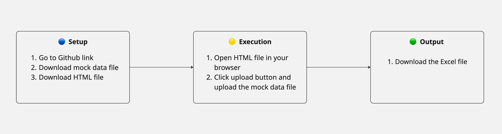

# Interactive Crypto Tax Tool - CSV to IRS Form 8949

## Overview

This project demonstrates how generative AI can be used to rapidly prototype a practical data transformation tool. It allows users to upload a CSV or Excel file of cryptocurrency transactions, map their columns to the required IRS Form 8949 inputs, and generates a downloadable Excel file formatted for capital gains tax reporting. The tool was built through prompt-driven collaboration with Claude (Anthropic AI).

## Demo

[Demo video](demo.mp4)

## Try It

- Download the mock CSV
- Open the interface demo (locally)
- Generate an example output

## Business Context

Cryptocurrency investors often receive transaction history from multiple sources- wallets, exchanges, and platforms-each with its own inconsistent CSV format. Preparing these for IRS Form 8949 typically requires tedious manual cleanup. This project addresses that problem by enabling users to map their CSV headers to standard Form 8949 fields and instantly export a compliant Excel file. It's especially helpful for users with large numbers of transactions, now required to be reported line by line under new tax regulations.

## My Role

- Defined the tool’s core functionality and user flow
- Created a sample CSV structure to simulate real crypto data
- Outlined the desired format for the Excel export (Form 8949)
- Designed and refined prompts for Claude to generate the interface and logic
- Tested and iterated on the AI-generated output using mock data

Note: I did not manually write the code. The interface and logic were generated by Claude based on my prompts, examples, and specifications.

## AI Collaboration (Claude)

Using Claude and thorough prompt engineering, I generated:

- A simple HTML/JS interface for uploading files and mapping fields
- Python scripts for transforming the data
- Logic for exporting to Excel in IRS-compliant format

This project highlights how AI-assisted development can turn clear prompts and structured input into functional tools.

## Key Features

- Upload a CSV or Excel file with transaction history (mock data shown)
- Map user-provided columns to IRS Form 8949 fields
- Export a clean Excel file formatted for capital gains reporting
- Entire tool generated using AI based on prompt engineering

## Project Flow

The following flowchart outlines how a user interacts with the tool.

## Technologies Used

- HTML/CSS/JS for front-end UI (via Claude)
- Python with pandas and openpyxl for CSV data processing and Excel generation (via Claude)
- Mock crypto transaction data for testing and demonstration

## Debugging Note

One of the biggest challenges was getting Claude to generate code that matched exactly what I needed. At first, the outputs were too broad and often left out important pieces like form input handling or proper Excel formatting.

To get better results, I:

- Broke the task into smaller pieces - starting with prompts for the CSV upload logic, then moving onto field mapping and the export step
- Provided clear examples of the expected inputs and outputs in each prompt
- Refined prompts by testing the output, identifying gaps, and rephrasing instructions clearly

This process sharpened my ability to guide generative models with clarity and precision, especially when building tools that simulate user interaction and structured data export.

## Skills Demonstrated

- Prompt engineering and iterative AI collaboration
- Testing real-world compliance needs into a functional prototype
- Testing and validating AI-generated code

## Try It

- Download the mock CSV
- Open the interface demo (locally)
- Generate an example output

## Disclaimer

This project uses mock data and is not intended for real tax reporting.
